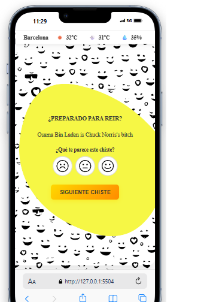

# App de Chistes con Clima

Una aplicación web interactiva que muestra chistes aleatorios de múltiples APIs, permite votarlos y muestra información meteorológica en tiempo real.

## 🌟 Características

- **Chistes Aleatorios**: Obtiene chistes de 3 APIs diferentes (Dad Jokes, JokeAPI, Chuck Norris)
- **Sistema de Votación**: Permite valorar los chistes con caras (triste, neutra, feliz)
- **Fondos Dinámicos**: Cambia automáticamente entre patrones Magic Pattern amarillos
- **Información Meteorológica**: Muestra temperatura, sensación térmica y humedad de Barcelona
- **Interfaz Responsiva**: Diseño adaptativo para diferentes dispositivos

## 🛠️ Tecnologías Utilizadas

- **TypeScript** - Lenguaje de programación tipado
- **HTML5** - Estructura semántica
- **CSS3** - Estilos y animaciones
- **ES6+ Modules** - Sistema de módulos moderno
- **Fetch API** - Peticiones HTTP
- **Magic Pattern** - Fondos SVG dinámicos

## 📁 Estructura del Proyecto

```
typescript-project/
├── src/
│   ├── api/
│   │   ├── jokesApi.ts      # APIs de chistes
│   │   └── weatherApi.ts    # API del clima
│   ├── models/
│   │   └── interfaces.ts    # Interfaces TypeScript
│   └── main.ts             # Lógica principal
├── public/
│   ├── assets/
│   │   └── img/            # Imágenes y SVGs
│   ├── index.html          # Página principal
│   └── style.css           # Estilos
├── build/                  # Archivos compilados
├── package.json
├── tsconfig.json
└── README.md
```

## 🚀 Instalación y Uso

### Prerrequisitos

- Node.js (versión 14 o superior)
- npm o pnpm

### Pasos de Instalación

1. **Clonar el repositorio**
   ```bash
   git clone <url-del-repositorio>
   cd typescript-project
   ```

2. **Instalar dependencias**
   ```bash
   npm install
   # o
   pnpm install
   ```

3. **Compilar el proyecto**
   ```bash
   npm run build
   ```

4. **Iniciar el servidor de desarrollo**
   ```bash
   npm run serve
   ```

5. **Abrir en el navegador**
   ```
   http://localhost:3000
   ```

## 🔧 Scripts Disponibles

- `npm run build` - Compila TypeScript a JavaScript
- `npm run dev` - Compila en modo watch (desarrollo)
- `npm run serve` - Inicia servidor HTTP en puerto 3000
- `npm run clean` - Limpia archivos compilados
- `npm start` - Compila y ejecuta (para Node.js)

## 🔑 Configuración de APIs

### APIs de Chistes (No requieren clave)
- **icanhazdadjoke.com** - Chistes de papá
- **v2.jokeapi.dev** - Chistes de programación, dark y spooky
- **api.chucknorris.io** - Chistes de Chuck Norris

### API del Clima (Requiere clave)
Para usar la funcionalidad del clima, necesitas una clave de OpenWeatherMap:

1. Regístrate en [OpenWeatherMap](https://openweathermap.org/api)
2. Obtén tu API key gratuita
3. Reemplaza la clave en `src/api/weatherApi.ts`:
   ```typescript
   const API_KEY = 'tu-api-key-aqui';
   ```

## 📸 Capturas de Pantalla

### Vista Principal


### Vista Móvil


## 🎯 Funcionalidades

### Sistema de Chistes
- Carga automática de chistes al iniciar
- Botón "Siguiente chiste" para cambiar
- Rotación aleatoria entre 3 APIs diferentes
- Manejo de errores con mensajes amigables

### Sistema de Votación
- 3 niveles de valoración (1-3 estrellas)
- Interfaz visual con caras expresivas
- Almacenamiento local de votaciones
- Posibilidad de cambiar votación antes del siguiente chiste

### Información Meteorológica
- Datos en tiempo real de Barcelona
- Temperatura actual y sensación térmica
- Humedad relativa
- Iconos descriptivos del clima

### Diseño Visual
- Fondos Magic Pattern dinámicos
- Animaciones suaves en hover
- Diseño responsive
- Paleta de colores amarillo-naranja

## 🔄 Flujo de Trabajo

1. La aplicación carga automáticamente un chiste y la información del clima
2. El usuario puede votar el chiste usando las caras
3. Al hacer clic en "Siguiente chiste":
   - Se guarda la votación actual
   - Se cambia el fondo Magic Pattern
   - Se carga un nuevo chiste aleatorio
   - Se resetea el formulario de votación

## 🐛 Solución de Problemas

### Error de Compilación
```bash
npm run build
```
Si hay errores de TypeScript, verifica que todas las dependencias estén instaladas.

### Error de API del Clima
Si no se muestra la información meteorológica:
1. Verifica que la API key sea válida
2. Comprueba la conexión a internet
3. Revisa la consola del navegador para errores

### Problemas de CORS
Las APIs de chistes están configuradas para permitir peticiones desde cualquier origen.

## 📝 Notas de Desarrollo

- El proyecto usa ES6 Modules para mejor organización
- TypeScript proporciona tipado estático
- Los fondos Magic Pattern se generan dinámicamente
- El sistema de votación persiste durante la sesión

## 🤝 Contribuciones

Las contribuciones son bienvenidas. Por favor:

1. Fork el proyecto
2. Crea una rama para tu feature (`git checkout -b feature/AmazingFeature`)
3. Commit tus cambios (`git commit -m 'Add some AmazingFeature'`)
4. Push a la rama (`git push origin feature/AmazingFeature`)
5. Abre un Pull Request

## 📄 Licencia

Este proyecto está bajo la Licencia ISC. Ver el archivo `LICENSE` para más detalles.

## 👨‍💻 Autor

Desarrollado como proyecto educativo para IT Academy.

---

**Nota**: Esta aplicación es solo para fines educativos y de entretenimiento. 